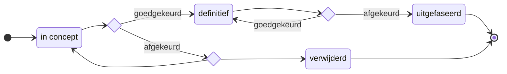

# Proces
Conceptversie
{: .label .label-yellow }

## Lifecycle van een begrip

```mermaid
stateDiagram-v2
    direction LR
    state "in concept" as concept
    state review <<choice>>
    state reviewOpties <<choice>>
    state definitief
    state uitgefaseerd
    state opgeheven
    state uitfasering <<choice>>
    
    [*] --> concept
    concept --> review
    review --> definitief: goedgekeurd
    review --> reviewOpties : afgekeurd
    reviewOpties --> concept
    reviewOpties --> verwijderd
    definitief --> uitfasering
    uitfasering --> definitief: goedgekeurd
    uitfasering --> uitgefaseerd: afgekeurd
    uitgefaseerd --> [*]
    verwijderd --> [*]
```

